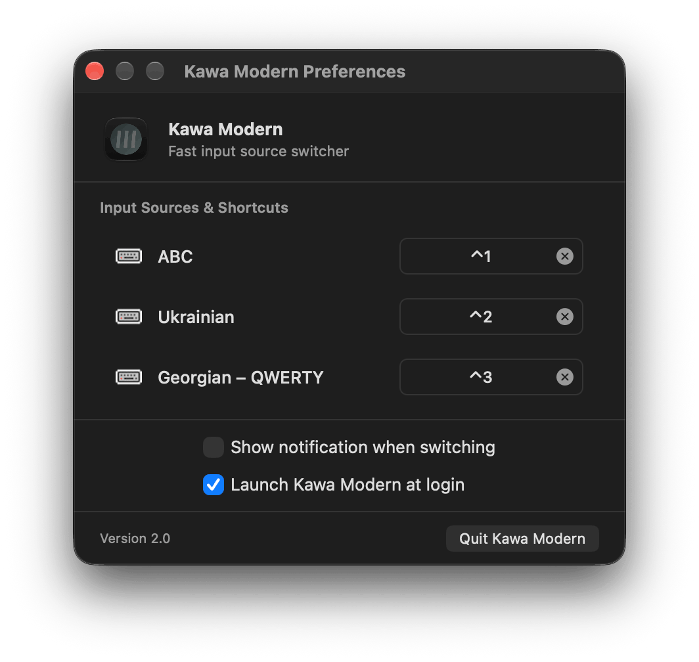

# Kawa Modern [](LICENSE) [](https://github.com/ghotriw/kawa-modern/releases)

A modern, ultra-fast macOS input source switcher with user-defined shortcuts.

> [!NOTE]
> **Kawa Modern** is a modernized, standalone continuation of the original [Kawa](https://github.com/hatashiro/kawa) project created by Hyunje Jun ([@hatashiro](https://github.com/hatashiro)). It has been completely re-engineered from the ground up for modern macOS with Swift and SwiftUI, zero external dependencies, and native Apple Silicon / Intel support.

<p align="center">
  
</p>

---

## Install

### Using [Homebrew](https://brew.sh/)

```shell
brew install ghotriw/tap/kawa-modern
```

### Manually

Download the latest prebuilt binary from [Releases](https://github.com/ghotriw/kawa-modern/releases):

1. Download `Kawa-Modern.zip`.
2. Unzip and drag `Kawa Modern.app` into your `/Applications` folder.
3. Launch **Kawa Modern**. When prompted, grant **Accessibility** permissions so the app can register global hotkeys.

---

## Requirements

* macOS 13.0 (Ventura) or later
* Apple Silicon (M1/M2/M3/M4) or Intel Mac (Universal binary)

---

## Development & Building

To build the project locally from source:

```bash
# Clone the repository
git clone https://github.com/ghotriw/kawa-modern.git
cd kawa-modern

# Build (Spotlight will ignore .noindex)
xcodebuild -project kawa.xcodeproj -scheme kawa -configuration Release -derivedDataPath build.noindex build

# Install to /Applications
cp -R "build.noindex/Build/Products/Release/Kawa Modern.app" /Applications/
```

Or open `kawa.xcodeproj` in Xcode and press **Cmd + R**.

---

## License & Credits

Kawa Modern is licensed under the [MIT License](LICENSE).

* Original Kawa created by [Hyunje Jun](https://github.com/hatashiro).
* Modernized and maintained by [Andrii Honcharov](https://github.com/ghotriw).
